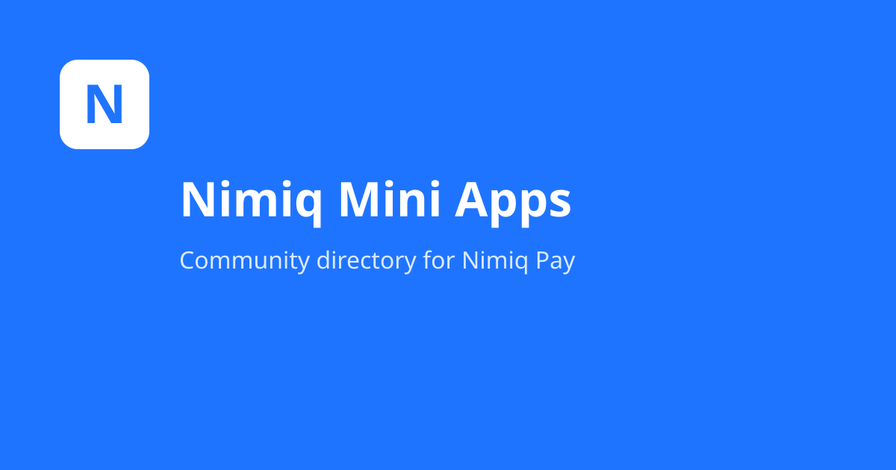
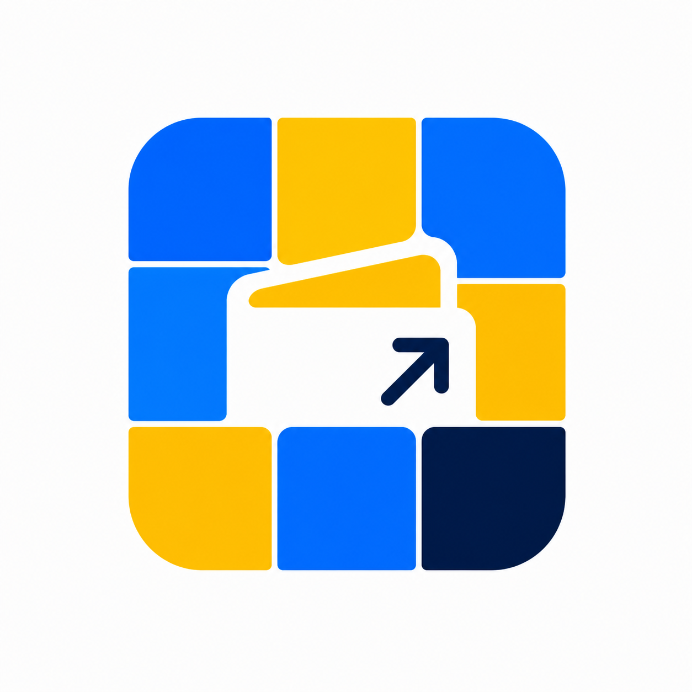

<p align="center">
  
</p>

<p align="center">
  
</p>

<h1 align="center">Nimiq Mini Apps</h1>

<p align="center">
  A community directory for <strong>Nimiq Pay</strong> mini apps.<br />
  Browse apps, open them in your wallet, and submit your own for review.
</p>

<p align="center">
  <a href="https://nimiqminiapps.com">Explore the catalog</a> ·
  <a href="https://nimpay.app">Nimiq Pay</a> ·
  <a href="https://nimiqminiapps.com/submit">Submit an app</a> ·
  <a href="./docs/DEV.md">Development guide</a>
</p>

---

## Stack

| Part | Tech |
|------|------|
| `frontend/` | Vue 3 + Vite + TypeScript + Tailwind |
| `backend/` | Go REST API (stdlib router, pgx) |
| Database | PostgreSQL (migrations + seed run automatically at startup) |
| Deploy | Docker Compose (Swarm-ready: stateless backend, env config, healthchecks) |

## Quick start

```bash
docker compose up --build
```

- Frontend: http://localhost:5173
- Backend API: http://localhost:8080
- Default admin token: `dev-admin-token-change-me` (override with `ADMIN_TOKEN=...`)

See [docs/DEV.md](docs/DEV.md) for local development, testing from a phone on your
LAN, and API examples.

## How it works

- **Browse** — search, filter by category or rewards, and view app details. Home highlights featured picks, trending (most viewed in the last 7 days), and curated collections. Every
  app gets an `Open in Nimiq Pay` link of the form `https://nimpay.app/miniapps/open/<domain>`.
  When an app’s first owner has a claimed NimConnect `@handle`, app detail and developer
  filter pages link to their public page at `https://nimconnect.nimiqminiapps.com/@handle`.
- **Submit** — developers log in with their Nimiq wallet and submit apps at `/submit`
  (rate-limited). Once approved, the submitting wallet can request edits to its own
  apps via `/apps/{slug}/update` or manage them from `/my-apps`.
  Submissions are hidden until reviewed.
- **Moderate** — connect an allowlisted admin wallet (see `ADMIN_WALLET_ADDRESSES`) or use a bearer token at `/admin`.

## API

Public: `GET /api/apps` (with `q`, `category`, `status`, `featured`, `sort`, `rewards`, `collection`),
`GET /api/apps/{slug}`, `POST /api/apps/{slug}/track` (open/view beacons), `GET /api/categories`, `GET /api/developers/{slug}`,
`POST /api/apps/submit`, `GET /health`, `GET /openapi.json`.

Owners and admins can read per-app stats at `GET /api/apps/{slug}/stats` (wallet session or admin token).

**OpenAPI** — full spec at [`docs/openapi.yaml`](docs/openapi.yaml), served live at
`/openapi.json` and `/openapi.yaml`. Regenerate embedded copies with `./scripts/gen-openapi.sh`.

**Agents** — see [`AGENTS.md`](AGENTS.md) for submit workflow, MCP usage, and OpenAPI maintenance.

Admin: allowlisted wallet session (`ADMIN_WALLET_ADDRESSES`) or `Authorization: Bearer <ADMIN_TOKEN>` — CRUD under `/api/admin/apps` plus `/verify`, `/approve`, `/reject` actions.

**MCP** — see [`mcp/README.md`](mcp/README.md) for a Cursor MCP server that wraps this API.

## CI

GitHub Actions tests and builds both services on every push/PR, and publishes Docker
images to GHCR (`ghcr.io/nimminiapps/nimiq-mini-apps-{backend,frontend}`) on pushes
to `main`.
